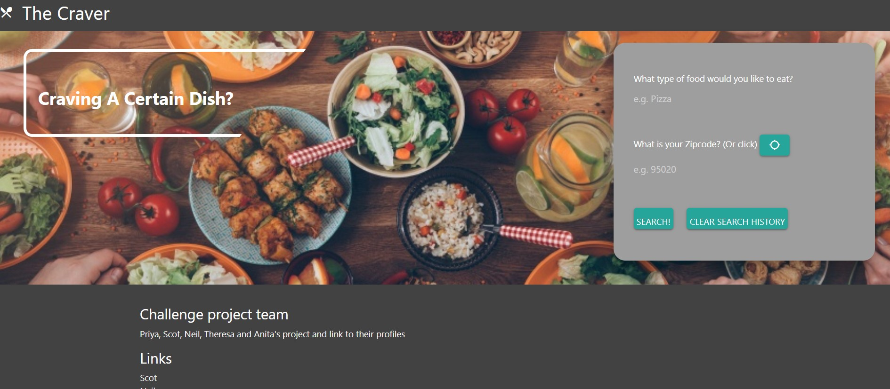
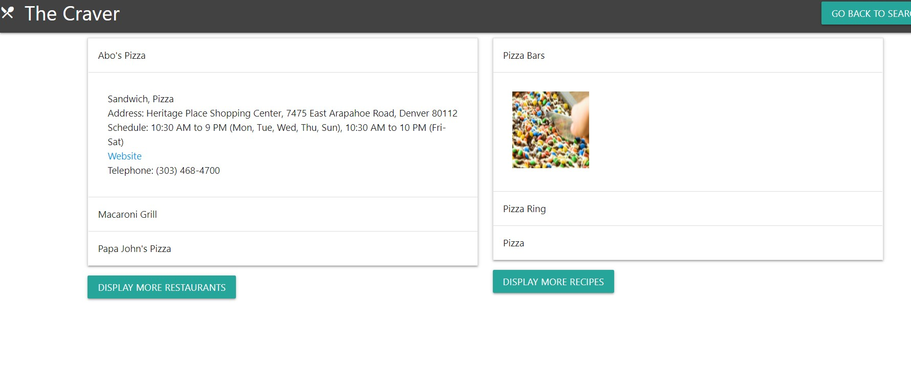
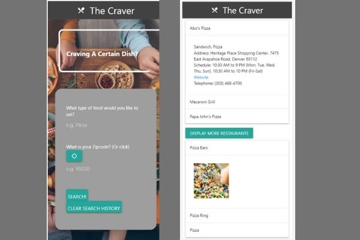

# The Craver

## Table of Contents
* [Description](#description)

* [Preview](#preview)

* [Usage](#usage)

* [Contributers](#contributers)

* [Way Ahead](#way-ahead)

* [Questions](#questions)

## Description

The Craver is a simple search application using restful API's to help you decide what to eat.  If you know what you want to eat, but are unsure if you want to cook or dine out, the craver will give you an assortment of recipes and nearby restaurants to satisfy your craving. This app is fully responsive to all screentypes and displays the lists on a clean colapsible style list.  It has a polished look for the landing page and makes deciding what to have for dinner easy!

* You can view deployed site at https://ngdino.github.io/fun-challenge-project/

## Preview 

* Landing Page

* Search Results

* Mobile View

## Usage
 
 This is a front end project no installation is necessary.  You can use at our deployed site https://ngdino.github.io/fun-challenge-project/ or simply clone or fork this repository, open locally, and right click and click view in default browser.

## Contributors

* Scot Itakura - Design of search results page, zomato api call for restaurants.
https://github.com/scotitakura

* Neil Dino - Design of landing page, recipe search JS file paircoded with Theresa, cleanup and README.
https://github.com/NGDino

* Anita Ganti- Zip code search API, search form
https://github.com/anitapeppercornhttps://github.com/anitapeppercorn

*Priya Ravi - Priya is an experienced front end developer.  She helped with repository oversite, debugging and helping the team with any questions
https://github.com/priyaravi23

* Theresa Nguyen - Pair coded Spoonacular API call and rest of Recipe Search JS file with Neil.
https://github.com/franamaus

## Way Ahead
 This project was completed to meet all grading requirements of the Front End Project for UC Berkeley Extension Coding Bootcamp.  It was accomplished during a two week sprint and was for most contributors our first time working as a team on a shared repository.  If this project was to have improvements made we would do the following: 
 * fix the message stating the restaurant type is not found after searching.
 * add gps capibility to find your location
 * add click to navigate functionality
 * show reviews for restaurants and recipes

 ## Questions 
 If you have questions about this project, or if you would like to contribute, visit our repo at [GitHub](https://github.com/scotitakura/fun-challenge-project) or contact Neil directly at <n.dino90@gmail.com>.